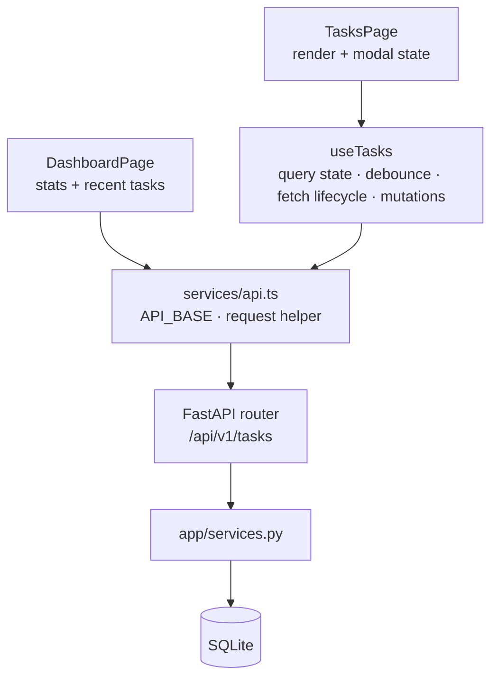

# Phase 0 — Stabilization & Engineering Foundation

> The permanent engineering record for Phase 0. Written against the **actual final
> repository state** (verified by running the test suites), not against the original
> plan. Where the implemented solution differs from what was first proposed, the
> actual implementation and its tradeoff are documented.

---

## 1. Objective

Phase 0 existed to make the Task Manager codebase **trustworthy before any product
features were layered on top of it**.

The problems it targeted:

- The frontend hardcoded its API base URL and scattered request construction.
- `TasksPage` fetched task data through three overlapping paths (`fetchTasks`
  callback, a `useEffect`, and direct `getTasks()` calls), so every feature change
  risked breaking one path and not the others.
- Search fired one API request per keystroke; stale responses could overwrite newer
  results.
- Backend list ordering was non-deterministic for equal `created_at`, breaking
  pagination stability.
- Whitespace-only task titles were accepted by the API.
- The `/stats` endpoint had an untyped dictionary contract.
- Backend tests wrote to a persistent file (`test.db`) on the developer's disk.
- Nothing ran automatically — no CI — so regressions reached `main` unnoticed.

**Why stabilization before authentication/ownership:** Phase 1 (users, workspaces,
ownership) will touch nearly every file in the backend and much of the frontend.
Building multi-tenant features on top of a frontend whose data layer had three
competing fetch paths — and a backend with no CI — would multiply the cost of every
later change. Phase 0 makes the foundation boring and predictable first.

**Exit condition:** all eleven items below complete, backend and frontend suites
green, CI validating both. Phase 0 deliberately ships **no product features**: no
new UI, no new endpoints, no schema changes.

---

## 2. Architecture Before Phase 0

### Backend

| Layer | File | Pre-Phase-0 state |
|---|---|---|
| Framework | `app/main.py` | FastAPI app, CORS from `app/config.py`, global exception handler (already good) |
| Config | `app/config.py` | `pydantic-settings` with `DATABASE_URL`, `ALLOWED_ORIGINS` (already good) |
| Router | `app/routers/tasks.py` | CRUD endpoints; `/stats` returned an untyped `dict` |
| Service | `app/services.py` | All business logic; `get_tasks()` ordered by `created_at.desc()` only |
| Schemas | `app/schemas.py` | `TaskCreate`/`TaskUpdate` with `min_length=1` titles — `" "` passed validation |
| Model | `app/models.py` | `Task` model; `priority` stored as plain `String(10)` (no DB constraint) |
| Database | `app/database.py` | Engine + `SessionLocal` from settings; Alembic migration `44840f774604` created the `tasks` table |

### Frontend

| Layer | File | Pre-Phase-0 state |
|---|---|---|
| Pages | `frontend/src/pages/TasksPage.tsx` | Owned task state, query state, and **three** fetch paths |
| API service | `frontend/src/services/api.ts` | Hardcoded `/api/v1` base; typed request helpers (already structured) |
| Types | `frontend/src/types/task.ts` | `Task`, `Priority`, `TaskStats`, etc. (already good) |
| Components | `frontend/src/components/tasks/` | `TaskTable`, `TaskForm` — presentational |
| Hooks | `frontend/src/hooks/` | UI utilities only (`useToast`, `useDocumentTitle`, …) — no data hooks |

### How task data flowed before

```text
TasksPage
 ├── useState(tasks/total/loading/error)      ← state duplicated here
 ├── fetchTasks()  → getTasks()               ← path 1 (called after mutations)
 ├── useEffect → getTasks()                   ← path 2 (query changes)
 └── direct getTasks()                        ← path 3 (Retry button)
```

Every path built its own URLSearchParams and managed its own loading/error state.
The dashboard (`DashboardPage.tsx`) had a smaller version of the same duplication.

---

## 3. Item-by-Item Analysis

### 0.1 API Configuration

- **Problem:** the API base path was hardcoded in `api.ts`; switching to a
  deployed backend required editing source.
- **Root cause:** the app was born as a dev-server-only project; the Vite proxy
  made the hardcode invisible.
- **Implementation:** one authoritative `API_BASE` constant in
  `frontend/src/services/api.ts`, read from `import.meta.env.VITE_API_URL`,
  falling back to `/api/v1` (same-origin, proxied by the Vite dev server to
  `localhost:8000`). All request helpers build URLs exclusively from it.
  `frontend/src/vite-env.d.ts` types the variable; `frontend/.env.example`
  documents it.
- **Files affected:** `frontend/src/services/api.ts`, `frontend/src/vite-env.d.ts`,
  `frontend/.env.example` (new).
- **Architecture impact:** environment access is confined to one module. Components
  never see env vars.
- **Behavior before:** every request hit same-origin `/api/v1` regardless of
  deployment. **Behavior after:** `VITE_API_URL` (build-time) redirects all
  traffic; unset means dev-proxy behavior, unchanged.
- **Testing:** frontend suite mocks `../services/api`, so URL construction is
  exercised indirectly by the backend route contract tests; dev-proxy flow verified
  manually in `vite.config.ts` terms.
- **Remaining limitations:** build-time only (no runtime injection); no auth
  headers yet — by design.

### 0.2 `useTasks` Hook

- **Problem:** task-list state and fetching lived inside `TasksPage`; the same
  logic could not be reused and could not be tested in isolation.
- **Root cause:** the page grew organically from a prototype.
- **Implementation:** `frontend/src/hooks/useTasks.ts` — the single frontend
  abstraction for task-list data. Owns `tasks`, `total`, `loading`, `error`, the
  full query state, the fetch lifecycle, and the mutation actions
  (`createTask`, `updateTask`, `deleteTask`, `toggleComplete`) which refresh via
  the same mechanism. Reuses existing domain types from `types/task.ts`; no state
  library was added (deliberately — the app's needs fit `useState` + one effect).
- **Files affected:** `frontend/src/hooks/useTasks.ts` (new).
- **Architecture impact:** pages become UI coordinators; the hook is the only
  consumer of the tasks API for list data.
- **Behavior before:** state and fetching interleaved with markup.
  **Behavior after:** `TasksPage` destructures state + actions from the hook.
- **Testing:** 20 hook tests in `frontend/src/hooks/useTasks.test.tsx` mock the
  API module and assert state transitions, query propagation, and mutation
  refresh behavior.
- **Remaining limitations:** mutations still trigger a full list refetch rather
  than in-place cache updates (accepted: correctness over cleverness at this scale).

### 0.3 Duplicate Fetching Removal

- **Problem:** three fetch paths in `TasksPage` (callback, effect, direct call)
  could race and duplicated URL/state logic.
- **Root cause:** incremental feature growth — Retry, mutations, and pagination
  each bolted on their own fetch.
- **Implementation:** all fetching collapsed into **one** effect inside
  `useTasks`, keyed on the query object plus a `reloadToken`. `refresh()` bumps
  the token so mutations and the Retry button reuse the identical path.
- **Files affected:** `frontend/src/pages/TasksPage.tsx` (−117 lines of data
  logic), `frontend/src/hooks/useTasks.ts`.
- **Architecture impact:** established the rule — *one authoritative fetch per
  data domain* — later applied to the dashboard too.
- **Behavior before:** any state change risked double-fetching.
  **Behavior after:** exactly one in-flight list request per query state.
- **Testing:** hook tests assert the effect fires once per change and that
  `refresh()` reuses the same path.
- **Remaining limitations:** none for the tasks page; the dashboard kept its own
  duplication until the post-Phase-0 production cleanup (see §13).

**Supporting fix (required, not scope creep):** `useToast` was converted to a
module-level shared store (`frontend/src/hooks/useToast.ts`). Before this,
`TasksPage.addToast()` and `Layout`'s `ToastContainer` each held a *separate*
toast list, so toasts raised on the Tasks page never rendered at all. The
existing toast UX could not survive the refactor without it.

### 0.4 Centralized Query State

- **Problem:** page/filter/search/page state was spread between `TasksPage` and
  `TaskTable` props; the hook received already-mangled query fragments.
- **Root cause:** the pre-0.2 design had no single owner for "what list am I
  looking at."
- **Implementation:** `TaskQueryState` (`page`, `filter`, `priority`, `search`)
  is an immutable object owned by the hook. Setters
  (`setPage`, `setFilter`, `setPriorityFilter`) apply functional updates;
  setting a value that is already current is a **no-op** (and therefore does not
  refetch) — matching React's bail-out semantics.
- **Files affected:** `frontend/src/hooks/useTasks.ts`, `frontend/src/pages/TasksPage.tsx`.
- **Architecture impact:** the fetch effect depends on one stable object; no
  dependency-array sprawl.
- **Behavior before:** filters reset pages inconsistently at the component layer.
  **Behavior after:** every filter change resets `page` to 0 inside the hook, so
  the behavior cannot diverge between components.
- **Testing:** hook tests cover page-reset on filter/priority/search change and
  the same-value no-op.
- **Remaining limitations:** query state is not reflected in the URL (shareable
  links deferred).

### 0.5 Debounced Search

- **Problem:** one API request per keystroke; `"meeting"` fired 7 requests.
- **Root cause:** the search input was wired directly to the applied query.
- **Implementation:** new reusable `frontend/src/hooks/useDebounce.ts` (no
  dependency). The hook exposes `searchInput` (raw typing, instant UI) separately
  from `search` (applied query). The applied value commits **during render** using
  React's documented "adjust state when a value changes" pattern, so the very next
  effects run already see the consistent query — exactly one request per
  effective-search change, no transient fetches. Constant `SEARCH_DEBOUNCE_MS =
  300` is exported from `useTasks`.
- **Whitespace handling:** the debounced input is trimmed before it becomes the
  applied search; whitespace-only input (`""`, `" "`, `"    "`) is **no search
  filter**. A whitespace-only variation of an existing search is a no-op (no
  refetch). The API service trims again as defense-in-depth.
- **Files affected:** `frontend/src/hooks/useDebounce.ts` (new),
  `frontend/src/hooks/useTasks.ts`, `frontend/src/pages/TasksPage.tsx`,
  `frontend/src/services/api.ts`.
- **Behavior before:** laggy UI, request storm. **Behavior after:** input updates
  instantly; the API sees one request 300 ms after typing stops.
- **Testing:** hook tests use fake timers to assert typing does not fetch until
  the debounce elapses, that whitespace-only input is not a filter, and that the
  page resets on a *changed* search.
- **Remaining limitations:** no URL persistence, no minimum-term-length rule.

### 0.6 Stale Request Protection

- **Problem:** a slow response for `"meet"` could arrive after `"meeting"`'s and
  overwrite newer results.
- **Root cause:** fetches had no lifecycle; there was no cancellation and no
  response-ownership check.
- **Implementation:** the single fetch effect creates an `AbortController` per
  run and aborts it in cleanup; `getTasks(params, signal?)` threads the signal
  through the existing `request<T>()` helper (no duplicated fetch logic). A
  second guard, an `active` flag, makes any late settle a no-op — covering
  responses that already arrived or environments where cancellation still
  delivers the response. **Abort errors are swallowed**: `!active ||
  controller.signal.aborted` leaves tasks/error exactly as the newer request left
  them — a cancelled request is a lifecycle event, not an app error.
- **Invariant:** *only the latest relevant request may update task-list state.*
- **Files affected:** `frontend/src/hooks/useTasks.ts`,
  `frontend/src/services/api.ts` (signal parameter on `getTasks` only).
- **Behavior before:** last-*arriving* response won, even if it was for an
  outdated query; cancellations surfaced as "Failed to load tasks."
  **Behavior after:** latest-*issued* request owns the state; cancellations are
  silent; genuine failures still reach the error UI with Retry.
- **Testing:** hook tests cover stale-response rejection, stale-failure
  suppression, abort-error silence, and genuine-error propagation.
- **Remaining limitations:** mutations are not cancelled (single-flight user
  actions); no request de-duplication cache.

### 0.7 Deterministic Ordering

- **Problem:** SQLite returns rows for equal `created_at` in arbitrary order;
  pagination could show the same task twice or skip one.
- **Root cause:** the ordering lacked a total tiebreaker.
- **Implementation:** `app/services.py::get_tasks` orders by
  `created_at DESC, id DESC`, applied **before** `.offset()/.limit()` in the same
  SQLAlchemy chain, so pages are stable. No `sort_by`/`sort_order` API was added
  (user-selectable sorting belongs to a later phase).
- **Files affected:** `app/services.py`.
- **Behavior before:** page 1 and page 2 could disagree about row order for
  same-timestamp tasks. **Behavior after:** total, stable order.
- **Testing:** `tests/test_phase0_stabilization.py::TestDeterministicOrdering` —
  newest-first, explicit same-`created_at` tie broken by higher id, page-by-page
  traversal covers every task exactly once, ordering holds under filters.
  Tests control `created_at` explicitly via direct model insertion, so they do
  not depend on SQLite clock resolution.
- **Remaining limitations:** no composite index on `(created_at DESC, id DESC)`
  — irrelevant at current scale, listed in technical debt.

### 0.8 Validation

- **Problem:** `POST`/`PUT` accepted `" "`, `"\t"`, `"\n"` as task titles.
- **Root cause:** `min_length=1` counts whitespace as content.
- **Implementation:** shared `TitleField` annotation in `app/schemas.py`:
  `Field(min_length=1, max_length=255)` + `AfterValidator(_normalize_title)`,
  which **trims** surrounding whitespace and **rejects** titles empty after
  trimming — normalization chosen over rejection so `"   Buy groceries   "` is
  stored as `"Buy groceries"`. Applied to both `TaskCreate` and `TaskUpdate`.
  `TaskUpdate` additionally rejects an explicit JSON `null` title (omitting the
  field still means "no change"), so an existing valid task can never become
  invalid. Purely Pydantic mechanisms — no custom validation framework.
- **Priority DB-level enforcement status:** the `priority` column is a plain
  `String(10)` VARCHAR. Application-level validation (the shared `Priority` enum
  in every schema and query parameter) is verified working. The database-level
  gap — a direct DB write can persist an arbitrary value — is **documented in a
  comment on the column in `app/models.py`** and pinned by a canary test. No
  CHECK constraint was added because Phase 0's exit condition forbids schema
  changes; the constraint belongs to future migration work.
- **Files affected:** `app/schemas.py`, `app/models.py` (comment only).
- **Testing:** `TestTitleValidation` — parametrized rejection of the five
  whitespace variants on create *and* update, rejected update leaves the task
  untouched, null-title rejection, trim on create and update.
- **Remaining limitations:** description not trimmed; DB constraint deferred (§12).

### 0.9 Typed Stats Response

- **Problem:** `/stats` returned an untyped `dict`; the contract lived only in
  the service body and the frontend type.
- **Root cause:** the endpoint predated the response-model discipline.
- **Implementation:** `TaskStatsResponse` in `app/schemas.py` with exactly the
  six fields already returned — `total, completed, pending, high, medium, low` —
  no invented statistics, no renames. `app/routers/tasks.py` declares
  `response_model=TaskStatsResponse`; `app/services.py::get_task_stats` is
  annotated `-> TaskStatsResponse`, consistent with the existing
  services-import-from-schemas convention.
- **Files affected:** `app/schemas.py`, `app/services.py`, `app/routers/tasks.py`.
- **Frontend compatibility:** zero changes — the JSON shape was already identical
  to `TaskStats` in `types/task.ts`.
- **Behavior before:** OpenAPI showed `200` as an empty schema.
  **Behavior after:** Swagger/ReDoc expose the typed model; FastAPI validates
  and documents it.
- **Testing:** `TestTypedStatsResponse` — exact response shape, OpenAPI `$ref`
  assertion, service returns the typed model, empty-database zeros.
- **Remaining limitations:** none for this endpoint.

### 0.10 SQLite Test Fixture

- **Problem (actual, verified before the fix):** `tests/conftest.py` used
  `sqlite:///./test.db` — a **file-backed** database in the repository root.
  Tests created/dropped all tables on every test, wrote to the developer's disk,
  left `test.db` behind, and could collide with concurrent runs.
- **Root cause:** the fixture predates the team's awareness that in-memory SQLite
  needs shared-connection lifecycle management.
- **Implementation:** the test database is now `sqlite:///:memory:`. Because
  in-memory SQLite lives per-connection, the fixture uses the
  **transactional-rollback** pattern: tables are created once per test on the
  shared engine, one connection opens a transaction, the test session is **bound
  to that connection object**, and the app's `get_db` dependency is overridden to
  yield that exact session — so every request, regardless of which thread
  FastAPI's threadpool runs it on, operates on the same in-memory database
  (`check_same_thread=False`). The transaction rolls back at test end. Properties:
  no file on disk, the developer's real `task_manager.db` is unreachable, zero
  state leakage between tests, consistent across repeated runs, and CI-ready.
  The obsolete `test.db` artifact was removed.
- **Files affected:** `tests/conftest.py` (rewritten fixture).
- **Behavior before:** `pytest` mutated `./test.db` (~20 s suite).
  **Behavior after:** fully isolated in-memory runs (suite dropped to ~2.4 s —
  roughly **8× faster**, since drop/create-per-test became rollback-per-test).
- **Testing:** the full 104-test suite passes against the new fixture; isolation
  verified by running the suite repeatedly (any leakage would fail the
  empty-database assertions in `test_stats_empty`/`test_list_tasks_empty`).
- **Remaining limitations:** `Base.metadata.create_all()` runs per test function
  rather than using Alembic migrations in tests — a known, accepted divergence
  (see technical debt).

### 0.11 GitHub Actions CI

- **Problem:** nothing validated the repo; regressions reached `main`.
- **Implementation:** `.github/workflows/ci.yml` with two independent jobs.
  **Backend:** checkout → Python 3.10 (with pip cache) → `pip install -r
  requirements.txt` → `pytest tests/ -v`. **Frontend:** checkout → Node 22
  (Vite 8 / Vitest 5 require ≥ 20.19; 22 is current LTS — Node 18 would fail) →
  `npm ci` (lockfile-driven, cached via `frontend/package-lock.json`) →
  `npm run lint` → `npm run build` → `npm test`. Triggers: every
  `pull_request` and every push to `main`. **No `continue-on-error`** anywhere —
  any failing step fails the job. No secrets required: tests use the in-memory
  fixture and safe defaults from `app/config.py`.
- **Files affected:** `.github/workflows/ci.yml` (new).
- **Behavior before:** nothing. **Behavior after:** both suites gate every PR.
- **Testing:** workflow YAML authored and reviewed locally; **execution requires
  GitHub** (no local runner) — first push to a PR will verify it. Backend and
  frontend commands were run locally with identical commands and pass.
- **Remaining limitations:** no lint/typecheck job for Python (ruff/mypy) —
  candidate for a later hardening pass.

---

## 4. Frontend Architecture After Phase 0



| Piece | Responsibility |
|---|---|
| `TasksPage` | Rendering, modal/confirm state, wiring callbacks. **No fetching, no debounce, no AbortController.** |
| `useTasks` | Task list state, `TaskQueryState`, `searchInput` vs applied `search`, the single fetch effect, refresh token, mutations |
| `useDebounce` | Generic value-debounce primitive (timer cleaned up on change/unmount) |
| `services/api.ts` | `API_BASE`, `request<T>()` (JSON headers, error parsing, 204 handling, signal pass-through), all endpoints |
| `types/task.ts` | Domain types (`Task`, `Priority`, `TaskStats`, …) shared by page, hook, and service |
| `components/tasks/*` | Presentational; `TaskTable` props typed against `Priority` |

`DashboardPage` intentionally kept direct `api.ts` access (stats + recent-tasks is
a read-only two-call aggregate; `useTasks` owns *list* data). Its internal
duplicate fetch was removed in the post-Phase-0 cleanup: one effect keyed on a
`reloadToken`, Retry bumps the token — the same pattern `useTasks` uses.

**Why this beats the original:** one fetch path means one place to reason about
races, cancellation, and loading state; the data layer is unit-testable without
rendering the page; and a Phase 1 workspace filter has exactly one place to go.

---

## 5. Search Architecture

```text
searchInput (keystroke, instant)
  → useDebounce(300ms)                 [hook; timer re-armed per change]
  → .trim() → effectiveSearch          ['   ' → '' = no search filter]
  → applied query.search (+ page reset to 0, adjusted during render)
  → single fetch effect → getTasks(params, signal) → API
```

Typing `"meeting"` rapidly: intermediate values never reach the query — the
timer is discarded on every keystroke and only fires 300 ms after the last one.
Exactly one API request carries `search=meeting`, with `skip=0`.

- **Client vs backend:** the client owns *when* to ask; the backend owns
  *matching* (`ILIKE` on title/description, case-insensitive, trimmed term).
- **Whitespace:** whitespace-only input is not a filter (hook trims; service
  trims again defensively).
- **Cancellation:** every query change aborts the previous request; an `active`
  flag guarantees a late response cannot commit.
- **Pagination/filter interaction:** any *effective* search or filter change
  resets `page` to 0 inside the hook; a same-value change is a no-op. Backend
  total-count + deterministic ordering keep pages stable across the reset.
- **Limitations:** substring matching only (no FTS/tokenization — semantic
  search is explicitly a later phase); no URL persistence; no request result
  caching between identical queries.

---

## 6. API Layer After Phase 0

- **Base URL:** `VITE_API_URL` → `API_BASE` (0.1). Single construction point.
- **Endpoints:** `POST /tasks/`, `GET /tasks/` (skip, limit, completed, priority,
  search), `GET /tasks/stats`, `GET/PUT/DELETE /tasks/{id}`; health at `/` and
  `/health`. Mounted under `/api/v1`.
- **Ordering:** `created_at DESC, id DESC` before offset/limit (0.7).
- **Validation:** shared `TitleField` + null-title guard on update (0.8);
  `Priority` enum on every write path and the list filter.
- **Stats:** typed `TaskStatsResponse` (0.9).
- **Errors:** routers raise `HTTPException` with `ErrorResponse`-shaped details;
  a global handler in `app/main.py` prevents stack-trace leakage (returns a
  generic 500). The frontend `request<T>()` parses `{detail}` into thrown
  `Error`s that pages surface via toasts/error UI.
- **Layer responsibilities:** `router` = HTTP shape, status codes, OpenAPI
  metadata; `service` = business logic and queries; `schema` = boundary
  validation and serialization; `database` = engine/session. Routers never touch
  the ORM directly; services never touch HTTP.

---

## 7. Database State After Phase 0

- **Technology:** SQLite, file `task_manager.db` (dev/prod default from
  `DATABASE_URL`); **in-memory SQLite for tests** (0.10).
- **Schema:** single `tasks` table — `id` PK, `title` (String 255, NOT NULL,
  indexed), `description` (Text, nullable), `priority` (String 10, NOT NULL,
  default `medium`, indexed), `completed` (Boolean, NOT NULL, default false),
  `created_at`/`updated_at` (timezone-aware UTC).
- **Priority representation:** Python-side `Priority(str, Enum)` shared by
  schemas, router query param, and services; stored as VARCHAR. **Known gap:** no
  DB-level CHECK — documented on the column and pinned by a canary test.
- **Indexes:** `id`, `title`, `priority` (per the Alembic migration). No
  composite ordering index yet (fine at this scale).
- **Alembic:** one migration (`44840f774604` initial tasks table). **Phase 0
  added zero migrations** — mandated by the phase exit condition.
- **Deliberately NOT changed:** no `User`, `Workspace`, `WorkspaceMember`,
  `owner_id`, `assignee_id`, no status expansion, no due dates, no PostgreSQL.
  Those are Phase 1.

---

## 8. Testing Architecture After Phase 0

- **Backend:** `pytest` + FastAPI `TestClient` (104 tests:
  `tests/test_tasks.py`, `tests/test_phase0_stabilization.py`).
- **Test database:** in-memory SQLite via the transactional-rollback fixture
  (0.10). `app.database.get_db` is overridden with `Depends` to yield the
  transaction-bound session — the same session architecture the app uses, just
  pointed at an isolated database. Reliable because: no disk, no shared state,
  no ordering dependence, rollback = guaranteed clean start.
- **Key scenarios covered:** full CRUD lifecycle; search/filter/pagination
  matrix; deterministic ordering incl. tie-break and page stability; title
  validation (create/update, whitespace variants, null); priority enum
  round-trips; typed stats incl. OpenAPI contract; schema/index inspection.
- **Frontend:** Vitest + Testing Library + jsdom (`useTasks.test.tsx`, 20 tests)
  with the API module mocked; setup in `src/test/setup.ts`. Note:
  `vite.config.ts` sets `fileParallelism: false` — parallel vitest workers hang
  at startup on this Windows setup (project path contains a space); sequential
  startup is reliable. This is an environment workaround, not a code smell.
- **Gaps:** no component-level tests for `TaskTable`/`TaskForm` (hook layer is
  covered); no Python lint/typecheck in CI; no coverage tooling wired up.

---

## 9. CI Architecture

- **File:** `.github/workflows/ci.yml`.
- **Triggers:** `pull_request` (all branches) and `push` to `main`.
- **Backend job:** Python 3.10 + pip cache → `pip install -r requirements.txt`
  (the project's actual dependency system — pip/requirements, not uv/poetry) →
  `pytest tests/ -v`.
- **Frontend job:** Node 22 + npm cache (keyed on `frontend/package-lock.json`)
  → `npm ci` (reproducible lockfile install) → `npm run lint` → `npm run build`
  (includes `tsc -b` typecheck) → `npm test`.
- **Failure behavior:** no `continue-on-error`; any failing step fails the job
  and blocks the PR.
- **Environment configuration:** none required — tests use the in-memory
  fixture; app defaults come from `app/config.py` safe defaults. No secrets in
  the repo, none needed by CI.
- **How CI protects the repo:** every PR proves the API contract (backend
  tests), the UI logic (hook tests), type safety (`tsc -b`), and style rules
  (oxlint) before merge.
- **Verification status:** commands verified locally with identical invocations;
  workflow *execution* requires GitHub (`Locally verified: commands` /
  `Requires GitHub execution: workflow run`).

---

## 10. Security Baseline After Phase 0

> **Authentication and authorization are NOT implemented yet.** The API is an
> open, single-tenant CRUD surface. That is the accepted Phase 0 posture and the
> reason Phase 1 exists.

| Area | Current state |
|---|---|
| Configuration/secrets | `.env` gitignored; no secrets committed; safe defaults in `app/config.py`; `frontend/.env.example` documents env vars without values |
| CORS | Explicit origin allow-list (`ALLOWED_ORIGINS`, default localhost:5173); wildcard rejected by test; `allow_credentials=True` requires the allow-list |
| API exposure | No auth on any endpoint; anyone who can reach the port can read/write all tasks |
| Validation | Title/priority/lengths enforced at the Pydantic boundary; global handler prevents stack-trace leakage; error details contain ids, not internals |
| Database isolation | Tests provably cannot touch the real DB (in-memory); no production credentials anywhere |
| Dependency handling | Pinned-by-floor `requirements.txt`; lockfile-driven frontend install in CI; no known-vulnerable pins identified |
| Priority at DB level | Enforced only app-side — gap documented (§3, 0.8) |

**Phase 1 must address:** authentication (and token/session handling),
authorization/ownership on every task route, rate limiting, and revisiting
`allow_credentials` once origins are real.

---

## 11. Performance Baseline

**Already optimized**

- Stats: one aggregate query (`COUNT` + `SUM(CASE)`) instead of five queries.
- List: filtering, ordering, and pagination in a single SQL statement; total via
  `COUNT` on the filtered set.
- Frontend request frequency: 300 ms debounce → one search request per pause;
  AbortController kills superseded requests; same-value setters are no-ops.
- Test suite: in-memory DB with rollback — ~2.4 s for 104 tests.

**Future optimization (not implemented — listed only)**

- Composite index `(created_at DESC, id DESC)` when lists grow.
- Full-text search (SQLite FTS5 / PostgreSQL tsvector) — substring `ILIKE`
  scans as data grows.
- Mutation-driven cache updates instead of list refetch after create/update/
  delete.
- Keyset (cursor) pagination if offset pagination degrades on large tables.
- `VITE_API_URL`-served static assets + gzip/brotli at the hosting layer
  (bundle today: ~283.7 kB JS / 86.7 kB gzip).

---

## 12. Remaining Technical Debt

### Phase 0 deferred (documented, intentional)

- DB-level CHECK constraint (or `sa.Enum(Priority)`) on `tasks.priority` —
  requires a migration; canary test pins the gap.
- Description field not trimmed/validated beyond length.
- No composite ordering index; no coverage tooling; no Python lint in CI.

### Phase 1 required

- Authentication, authorization, ownership (`owner_id`), workspace model.
- PostgreSQL production configuration (SQLite stays for dev).
- URL state persistence and shareable task-list views.

### Phase 2 required

- User-selectable sorting (`sort_by`/`sort_order`).
- Full-text/semantic search foundations; analytics beyond the current six stats.

### Future

- Collaboration features, notifications, calendar integration, API keys,
  webhooks — out of scope for this record.

---

## 13. Phase 1 Readiness

**Ready (stable foundations — build on, do not rewrite):**

- Environment-driven API configuration (0.1) — auth base-URL/auth-header work
  slots into `services/api.ts` alone.
- `useTasks` single fetch path (0.2–0.4, 0.6) — ownership filters become one
  extra query param through the same pipe.
- Typed API boundary (0.8, 0.9) and shared `Priority` enum — new schemas follow
  the established pattern.
- Alembic infrastructure (existing migration, `env.py`) — Phase 1 migrations
  chain onto `44840f774604`.
- Test + CI infrastructure (0.10, 0.11) — every Phase 1 change is gated.

**Not ready (Phase 1 must supply):**

- Authentication/authorization — no user concept exists anywhere.
- Ownership — tasks have no `owner_id`; every query is global.
- Workspace model, PostgreSQL production config, secrets management.

**What Phase 1 should NOT change:** the `TasksPage → useTasks → api.ts` data
flow, the single-fetch invariant, the transactional test fixture, the CI
workflow, and the router/service/schema layering. These were stabilized at real
cost; extending them is cheap, replacing them is not.

---

## 14. Phase 1 Migration Considerations (analysis only — nothing implemented)

Introducing `User`, `Workspace`, `WorkspaceMember`, and task columns
(`owner_id`, `workspace_id`, `assignee_id`, `status`, `due_at`, `completed_at`,
`position`, `archived_at`) is the first schema change since `44840f774604`, and
it interacts with **existing data**:

- **Backfill problem:** every existing task row must receive an owner and a
  workspace. Options: a system user + default workspace created in the same
  migration, or a nullable transition period. Either way the *data* migration
  (backfill) and the *schema* migration (constraints) are separate steps.
- **Why `owner_id` cannot simply become NOT NULL immediately:** on an existing
  table, adding a NOT NULL FK column requires either a default value that does
  not exist yet or an immediate backfill of every row. The safe sequence is:
  add nullable column → backfill → enforce NOT NULL → add FK constraint (SQLite
  additionally requires table-rebuild for many constraint changes, which must be
  scripted carefully and tested against a copy).
- **`status` vs `completed`:** introducing a `status` column while `completed`
  exists risks two sources of truth. Decide the mapping (e.g. derive
  `completed` from status, or keep both synchronized in the service layer)
  before migrating, and backfill `status` from `completed`.
- **Ordering of migrations:** users/workspaces first, then task FK columns
  (nullable) → backfill → constraints → index creation for the new filter
  columns (`workspace_id`, `owner_id`, `status`). Every step must be reversible
  (`downgrade`) and CI-tested, including a migration run against a copy of a
  pre-Phase-1 database.
- **Data integrity concerns:** FK enforcement (SQLite needs `PRAGMA
  foreign_keys=ON` per connection), cascade behavior for workspace deletion, the
  deferred priority CHECK constraint naturally landing in this same migration
  window, and uniqueness rules for `WorkspaceMember` (user, workspace) pairs.

---

## 15. Phase 0 Final Scorecard

| Area | Status | Notes |
|---|---|---|
| API configuration | Complete | `VITE_API_URL` → single `API_BASE`; documented via `.env.example` |
| Task hook architecture | Complete | `useTasks` owns list data; 20 hook tests |
| Duplicate fetching | Complete | One fetch path in the hook (dashboard cleaned up post-Phase-0) |
| Query state | Complete | Immutable `TaskQueryState`; same-value no-ops; filter changes reset page |
| Debounced search | Complete | 300 ms `useDebounce`; trim-before-apply; one request per pause |
| Request cancellation | Complete | AbortController + active flag; aborts silent; stale can never commit |
| Deterministic ordering | Complete | `created_at DESC, id DESC` before offset/limit; tie-break tested |
| Validation | Complete | Shared `TitleField` (trim + reject empty) on create/update; null-title rejected |
| Typed stats | Complete | `TaskStatsResponse`; OpenAPI `$ref` asserted by test |
| Test database | Complete | In-memory SQLite + rollback; real DB unreachable; ~8× faster suite |
| CI | Complete | Two jobs, both suites, no `continue-on-error`; execution pending first GitHub run |

## 16. Phase 0 Exit Criteria

```text
✓ API configuration is environment-driven           (0.1)
✓ Task fetching has one authoritative frontend path (0.2, 0.3)
✓ Query state is centralized                        (0.4)
✓ Search is debounced                               (0.5)
✓ Stale requests cannot overwrite newer results     (0.6)
✓ Task ordering is deterministic                    (0.7)
✓ Invalid/whitespace-only titles are rejected       (0.8)
✓ Stats response is typed                           (0.9)
✓ Tests use a reliable isolated database            (0.10)
✓ CI validates backend and frontend                 (0.11)
```

**Verification results (actual, this repository):** backend `pytest` — 104
passed; frontend `oxlint` — 0 errors (1 pre-existing warning in `useCountUp`);
frontend `vitest` — 20/20 passed; frontend `npm run build` (`tsc -b` + Vite) —
clean. CI workflow YAML reviewed locally; its first real run requires GitHub.

# PHASE 0 — COMPLETE
